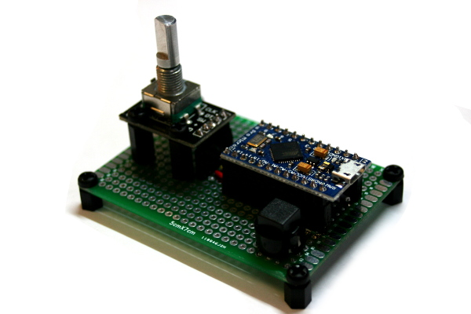

# HIDVolumeKnob

HIDVolumeKnob is a simple HID device

It uses:
* An Arduino Pro Micro (with ATmega32u4)
* A rotary encore with a switch
* [NicoHood's HID library](https://github.com/NicoHood/HID)

Handled keys:
* Volume Up
* Volume Down
* Play/Pause

