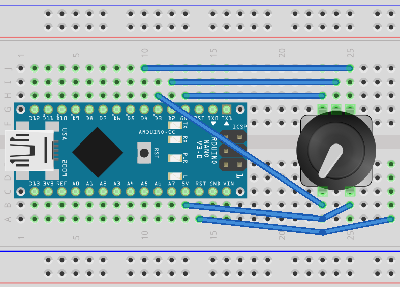

# NanoVolumeKnob

NanoVolumeKnob is a very volume controler for your Linux computer.
It uses:
* An Arduino Nano V3 (with ATmega328p)
* A rotary encore with a switch

Handled keys:
* Volume Up
* Volume Down
* Play/Pause

Keys' code are sent over serial interface. Then `UInputKeyboard` is in charge of
reading those code on the serial port and generated associated events via the
`uinput` device driver
